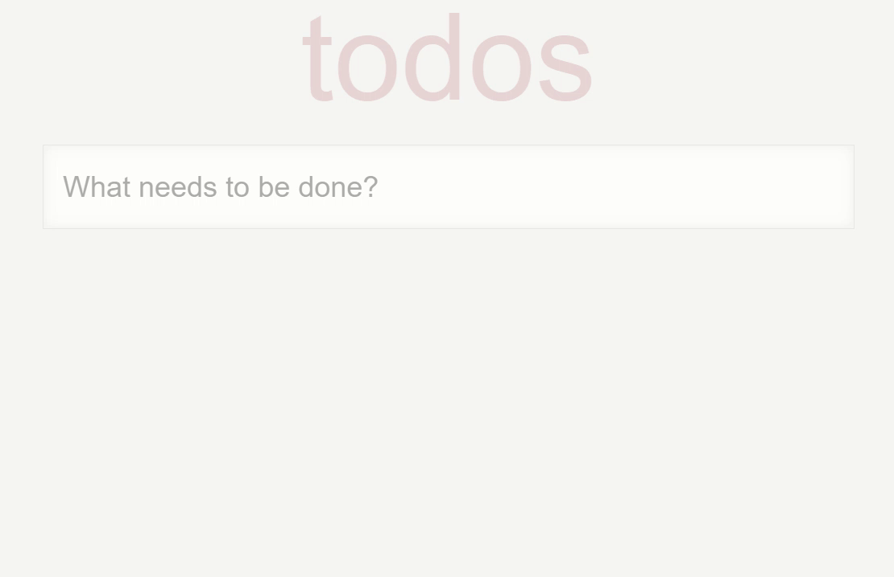

# EE 3035, Web Programming, 109-2
## Practice Homework #3: React.JS練習 - TODO List
### 1. usage
```
$ yarn install
$ yarn start
```
### 2. webpage 
This webpage is able to be viewed at the following link: [http://r09921057_web_programming_hw3.surge.sh/](http://r09921057_web_programming_hw3.surge.sh/)

### 3. demo gif
The following is the demo gif:\


### 4. references
* [Array.prototype.filter()](https://developer.mozilla.org/zh-TW/docs/Web/JavaScript/Reference/Global_Objects/Array/filter)
* [Array.prototype.map()](https://developer.mozilla.org/zh-TW/docs/Web/JavaScript/Reference/Global_Objects/Array/map)
* [Array.prototype.findIndex()](https://developer.mozilla.org/zh-TW/docs/Web/JavaScript/Reference/Global_Objects/Array/findIndex)
* [Event.target](https://developer.mozilla.org/zh-TW/docs/Web/API/Event/target)
* [Deploy your react app in 3 minutes with surge](https://medium.com/@viniciusgularte/deploy-your-react-app-in-3-minutes-with-surge-11bebe96b871)