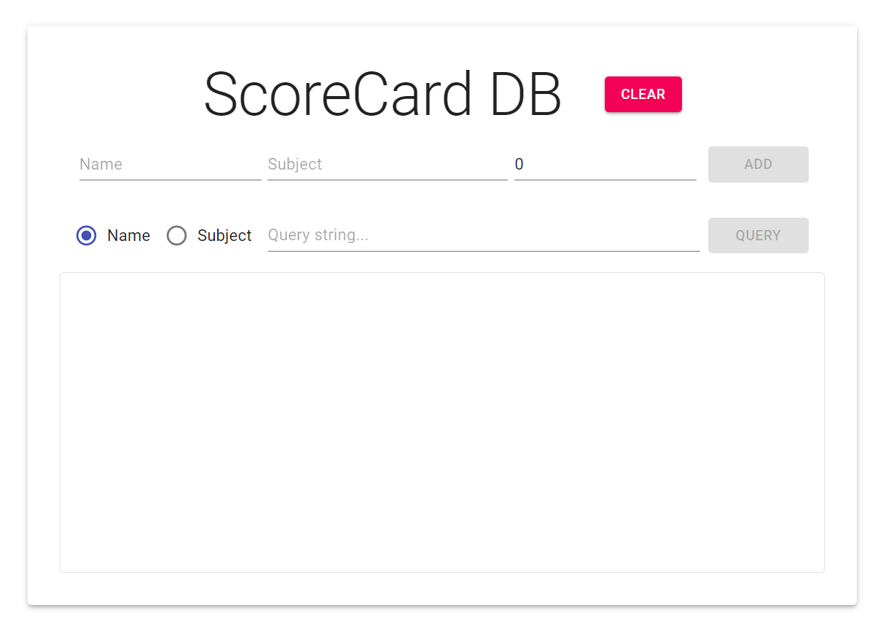
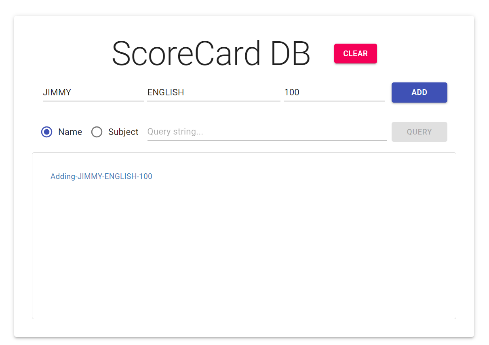
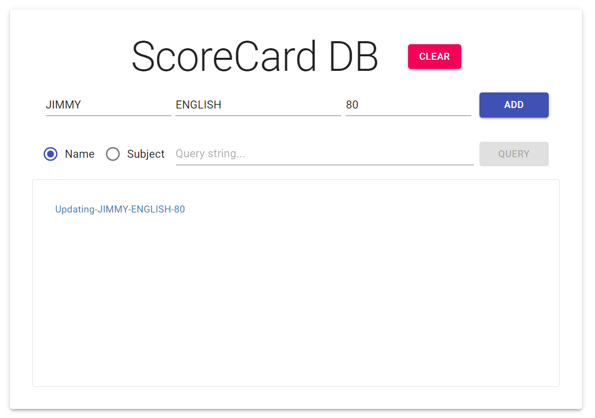
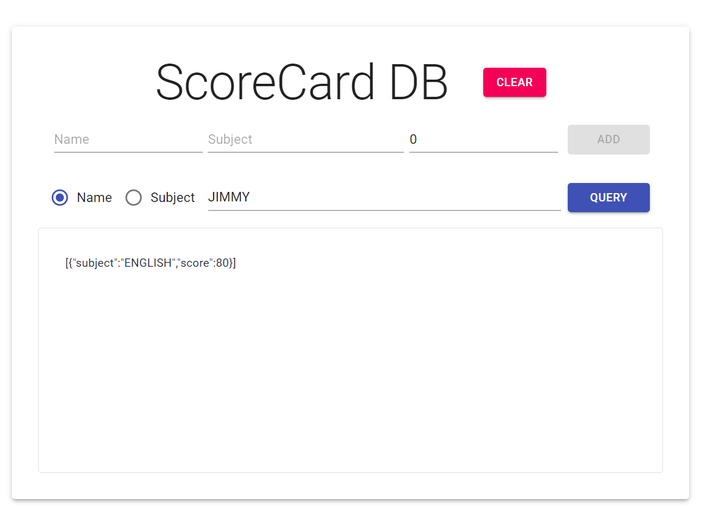
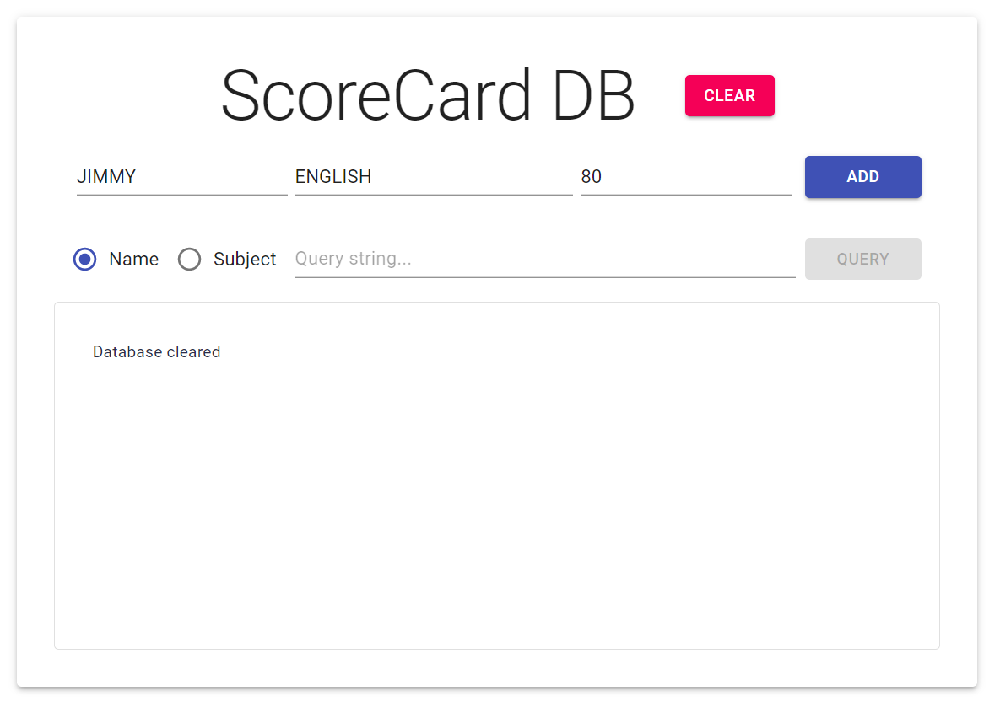
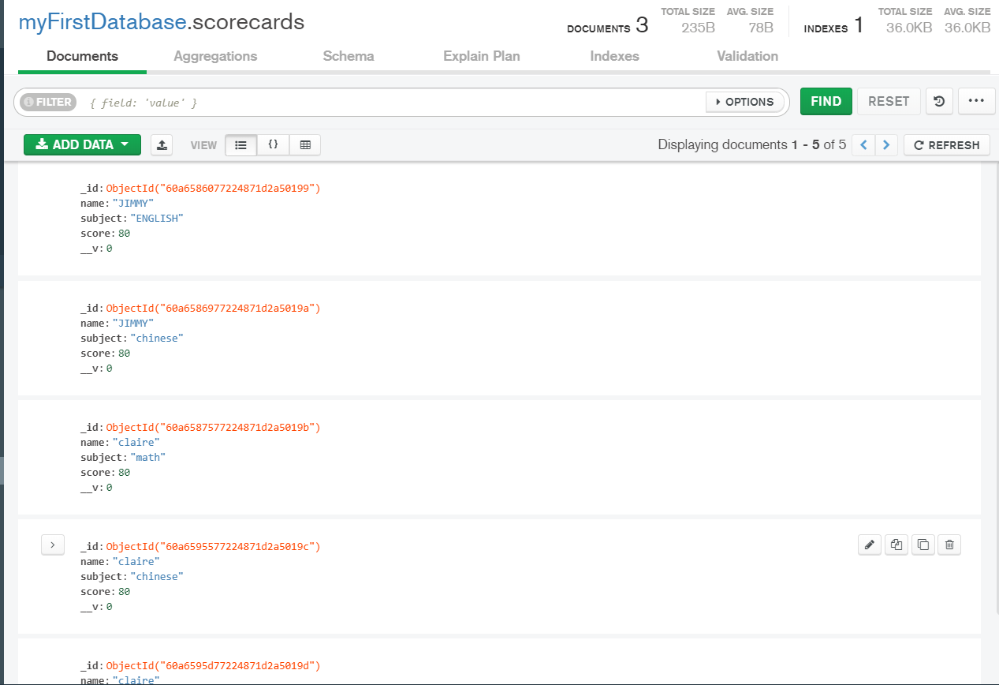

#ScoreCard DB

##FUCNCTION
### 1. Input name/subject/score can connect to serverand save in mongooseDB and show "Adding name:xxx subject:xxx score:xxx"

### if  name and subject have alreadt exist will update the score and show "updating name xxx subject xxx score xxx "

### 2. choose a mode(name or subject)and enter target,click query can search the db and print out the result in textbox

### 3.click clear buttom can clear the db and shoe "database clear" in textbox

###DB will look like

